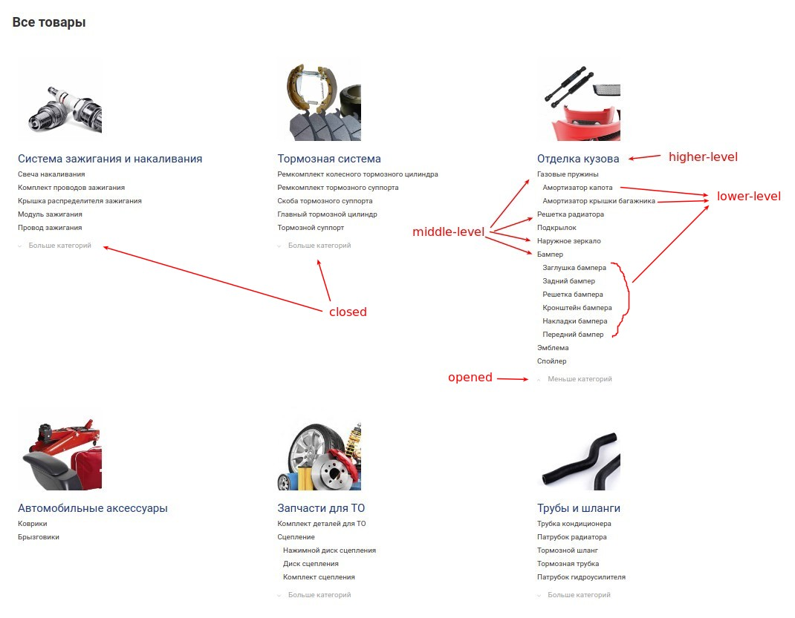

# test-task-nuxt

## Build Setup

```bash
# install dependencies
$ npm install

# serve with hot reload at localhost:3000
$ npm run dev

# build for production and launch server
$ npm run build
$ npm run start

# generate static project
$ npm run generate
```

For detailed explanation on how things work, check out [Nuxt.js docs](https://nuxtjs.org).

# First task

1) On first page you need to create product catalog.
2) You can get data from /static/productCatalog.json and parse it.
3) The best option is to create an array containing higher-level categories, 
which contain a list of middle-level product lines, 
which will accordingly have the list of lower-level product lines.
All elements can have multiple parents. You can see it in  all_parents field.
4) Use html and scss to show product line tree.
5) Design template you can get from ./assets/catalogDesignTemplates/
6) By default show 5 subcategories max. If we click on "show more" - display all subcategories.
7) If there are less than 5 subcategories (of any level?), you need to hide toggle button.
8) You can use any libraries for complete this task.



 

